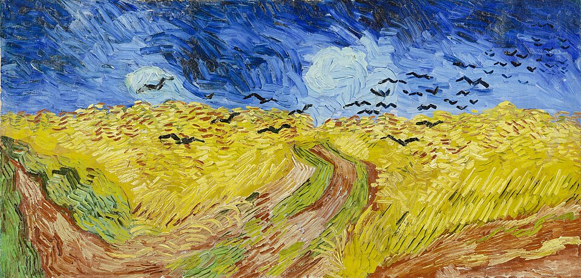

# Niva User Manual

## Why Niva?

### The problem with existing tools

Real Book-style lead sheets are the working documents of jazz performance:
chord symbols, section markers, repeat signs, a melody line if you need it.
Every gigging musician owns a stack of them.

Editing them digitally is surprisingly painful. Sibelius and MuseScore are
built for classical full scores — they bring hundreds of tools to a job that
needs about ten. LilyPond is powerful but its syntax was designed for
Western art music and fights you the moment you write `Cmi7b5` or `|:`. PDF
editors let you annotate an existing chart but not compose a new one from
scratch. iRealPro reads well on a tablet but its text format is undocumented
and can't be diffed or version-controlled.

### What Niva is

Niva is a **command-line tool** that reads a plain-text `.niva` file and
renders it as a PDF (or SVG) — the same kind of compact, bar-grid layout you'd
find in any Real Book.

```
niva render my-chart.niva        # → my-chart.pdf
```

A `.niva` file looks like what a musician would type if they were trying to
describe a chart in an email:

```niva
title "Autumn Leaves"; composer "Joseph Kosma"; style "Medium Swing"; tempo 132
key Gm; meter 4/4

[A]
| Cm7   | F7     | Bbmaj7 | Ebmaj7 |
| Am7b5 | D7     | Gm     |        ||
```

Because the format is plain text it works naturally with `git`, `grep`, and
any editor.

Niva is particularly useful for **roadmaps** — single-page reference charts
that overlay chord symbols and section structure on top of a printed lead
sheet. Write the roadmap, merge it into a PDF of the original chart, and hand
it to the rhythm section.

---

## Getting Started

### Installation

**macOS (recommended — via Homebrew):**

*Note:* `brew trust` is required once per machine for any third-party Homebrew tap.

```sh
brew tap nivatune/niva
brew trust nivatune/niva  
brew install niva
```

**Manual download (macOS):**

1. Download the latest `niva-<version>-universal-apple-darwin.tar.gz` from the
   [Releases page](../../releases).
2. Extract the archive and move both files — `niva` and `libpdfium.dylib` — to a
   directory on your `PATH` (e.g. `/usr/local/bin`). Keep `libpdfium.dylib` in
   the **same directory** as the `niva` binary; it is required for PDF output.

**Manual download (Windows):**

1. Download the latest `niva-<version>-x86_64-pc-windows-msvc.zip` from the
   [Releases page](../../releases).
2. Extract the archive and add the folder to your `PATH`, or move `niva.exe` and
   `pdfium.dll` to a directory already on your `PATH`. Keep `pdfium.dll` in the
   **same directory** as `niva.exe`; it is required for PDF output.
3. Windows Defender SmartScreen may warn about unsigned binaries until code
   signing is in place.

**Verify the install:**

```sh
niva --version
```

### Rendering your first chart

Save the following as `song-for-my-father.niva`:

```niva
niva version=1
title Song For My Father
composer H. Silver
style Med. Latin
tempo 126; key Fm; meter 4/4

[A]
|: F-7    | %      | Eb7  | % |
| Db7     | C7sus4 | F-7  |1. % :|2. F-7 ||

[B]
| Eb7     | %      | F-7  | % |
| Eb7 Db7 | C7     | F-7  | %  ||
```

Render it:

```sh
niva render song-for-my-father.niva
```

This produces `song-for-my-father.pdf`. Open it in any PDF viewer. To get an SVG
instead, name an `.svg` output: `niva render song-for-my-father.niva -o out.svg`.

---

## Language

### Directives

Directives are keyword lines that set score-wide metadata and rendering
options. Multiple directives can share a line, separated by `;`.

```niva
title "My Song"; composer "A. Composer"
style "Fast Swing"; tempo 200; key Bb; meter 4/4
```

| Directive | Description |
|-----------|-------------|
| `title "…"` | Chart title, displayed centered above the first system. |
| `composer "…"` | Composer name, displayed flush right on the header line. |
| `style "…"` | Performance marking (e.g. `"Med. Latin"`), displayed bold flush left. |
| `tempo N` | Metronome marking (quarter note = N). |
| `key X` | Key signature. `X` is a note name with optional `b`/`#` and optional `m`/`mi`/`-` for minor. Examples: `Bb`, `F#m`, `Fm`. |
| `meter N/D` | Time signature (e.g. `4/4`, `3/4`). |
| `niva version=1` | Declares the source format version. Optional; current version is 1. |

### Tracks — writing bars

A track is a line (or continuation lines) of measures. Each measure begins
with a barline token.

```niva
| Cm7  | F7  | Bbmaj7 | Ebmaj7 ||
```

#### Barlines

| Token | Meaning |
|-------|---------|
| `|`   | Single barline |
| `\|\|`  | Double barline |
| `\|:` | Repeat start |
| `:\|` | Repeat end |
| `\|\|\|` | Final (thin + thick) |

**Ending numbers** attach to the barline with no space and end with `.`:
```niva
|1. Cm7 :|2. Dm7 ||
```

#### Chords

Chord symbols follow standard lead-sheet notation:

```
root [accidental] [quality] [extensions] [/bass]
```

- Root: `A`–`G`
- Accidental: `b` (flat) or `#` (sharp)
- Quality: `m`, `mi`, `-` (minor), `maj`, `M` (major), `aug`, `dim`, `sus2`, `sus4`, `+`, `°`
- Extensions: `7`, `9`, `11`, `13`, `b5`, `#9`, etc.
- Bass note: `/C`, `/Gb`, etc.

Examples: `Cm7`, `Fmaj7`, `G7b9`, `Db7sus4`, `Am7b5`, `F-7`, `C/E`

Multiple chords in one bar are separated by spaces; each gets an equal share
of the bar's horizontal space:

```niva
| Eb7 Db7 | C7 | F-7 ||
```

#### Simile (`%`)

`%` repeats the previous bar and renders as the standard one-bar repeat glyph.

```niva
| F-7 | % | % | % ||
```

#### Ties

A tie is `_` after a chord, optionally followed by a duration:

```niva
| C_ | % ||         # C tied across the barline
| C_2 Dm7 ||        # C held for a half note, then Dm7
```

#### Durations

A duration is a number (`1`=whole, `2`=half, `4`=quarter, `8`=eighth…)
optionally followed by `.` for a dot:

```niva
| C4 F4 G2 ||       # quarter C, quarter F, half G
| Cmaj7.2 ||        # dotted half
```

### Section markers

A line whose first non-space character is `[` is a **marker line**. It binds
to the track immediately below it, placing section labels and annotations
above the matching barlines.

```niva
[A]
| Cm7 | F7 | Bbmaj7 | Ebmaj7 ||
```

Multiple sections on one marker line are separated by whitespace and align to
the bar directly beneath them by column:

```niva
[A] Head       [B] Solos      [A] Head out
| Cm7 | F7 || | Gm7 | C7 || | Cm7 | F7 ||
```

The section label itself (`A`, `intro`, `coda`, …) is free text.

### Annotations

Free text in a marker line (not inside brackets) becomes an above-staff
annotation attached to the bar beneath it:

```niva
[A] on cue
| F-7 | % ||
```

A quoted string `"…"` inside a measure is an in-staff annotation:

```niva
| "Horns" | F-7 ||
```

The standalone `annot` directive gives full control:

```niva
annot "Fade out", at=below
```

`at` values: `above` (default), `below`, `within`. `align` values: `left`
(default), `right`.

A `>|` prefix on a marker-line text item right-aligns it to the last bar:

```niva
[A] >| on cue
```

### Line breaks

Niva flows bars from consecutive track lines into one pool and breaks them
into rows automatically, up to the `--bars-per-row` limit (default 4).

Force a break with the `\n` symbol at the end of a bar:

```niva
| F-7 | Eb7 | F-7\n |
| Cm7 | F7  | Bb   ||
```

### Inline symbols

`\ident` attaches **postfix** to the preceding chord or note:

```niva
| Cmaj7\fermata | F7\staccato ||
```

Supported: `\fermata`, `\staccato`, `\marcato`, `\accent`, and others. An
unrecognized symbol warns and renders as text.

### Lead-sheet overlay (`merge`)

`merge` composites a Niva roadmap on top of an existing PDF lead sheet. The
source page is imported verbatim (original notation stays sharp), the
front matter is stripped, and the Niva overlay is painted above the body.

```niva
merge "original.pdf"
merge "original.pdf", cut = auto      # detect and remove front matter (default)
merge "original.pdf", cut = 42mm      # remove first 42 mm from the top
merge "original.pdf", cut = none      # keep the full original page
```

Output is always PDF when `merge` is present.

### Comments

Lines beginning with `#` are comments:

```niva
# This is a comment
| Cm7 | F7 ||
```

### CLI reference

```
niva render <file.niva> [-o <output>]      Render a chart to PDF (default) or SVG
niva render <file.niva> --format svg       Force SVG output
niva render <file.niva> --bars-per-row N    Limit bars per row (default 4)
niva render <file.niva> --config <f.toml>   Use a TOML config file
niva --version                             Print the version
```

Output defaults to PDF. Pass `--format svg`, or name an `.svg` output with
`-o`, to produce SVG instead. A score containing `merge` always renders to PDF.

## What's in the name?

"Niva" means "field" in many Slavic languages, including Russian, Ukrainian, Bulgarian.
The name shapes the project in a few (not always obvious) ways:

- Like a field of growing wheat, Niva is about *growing* music: widening access
  to music creation, especially the improvisational and popular kind.
- One of this project's inspirations was [LilyPond](https://lilypond.org/),
  whose name always evoked Claude Monet's *Water Lilies* in my mind. Moving from
  one painter's pond to another's fields felt like a natural progression — and
  Van Gogh's wheatfields carry exactly the restless energy this project is after.

<p align="center">
  
  <br>
  <em>Vincent van Gogh, "Wheatfield with Crows" (1890)</em>
</p>
